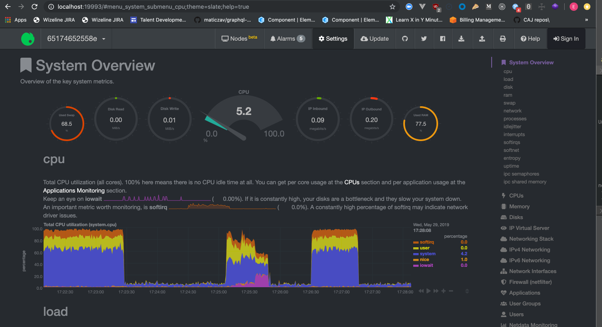

# Golang-performance-demo

> :warning: Work in progress. This repo is part of the talk from zero to hero in Go.

The aim of this repo is share an easy and containerized way to play with different application´s performance through a dashboard that uses dinamically apache benchmark to send requests to apis and see how this behaves in netdata server monitor.

Api´s were made with standalone libraries as the intention is compare the performance of each language by using the less layers(frameworks) as possible.

Stack:
Golang api
- Go
- `net/http` standalone library
- mysql
- Docker
    -  docker-compose
    - netdata

Php api
- php
- mysql
- standalone libraries (`mysqli`, `header`)
- Docker
    - docker-compose
    - netdata

NodeJs
- node
- `dotenv` library
- `http` standalone library
- Docker
    - docker-compose
    - netdata

### Php netdata
http://localhost:19991

### Node netdata
http://localhost:19992

### Go netdata 
http://localhost:19993

# Dashboard

# Netdata

### Future work 
TODO:
- [ ] De-couple dashboard and create a framework to test failure in services by shut down docker images (chaos monkey)
- [ ] Layer to detect docker-compose.yml files and orchestate them to run.